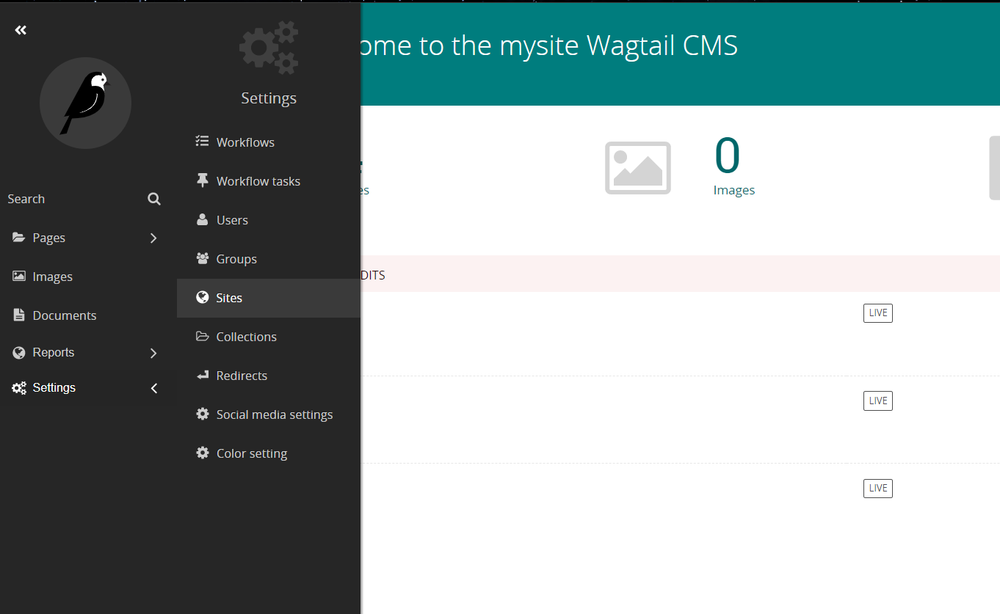
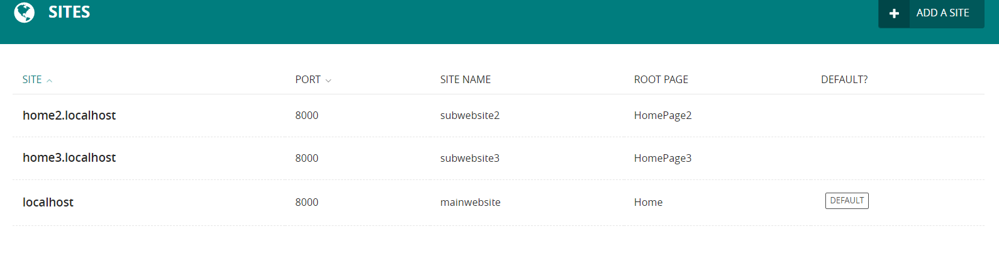
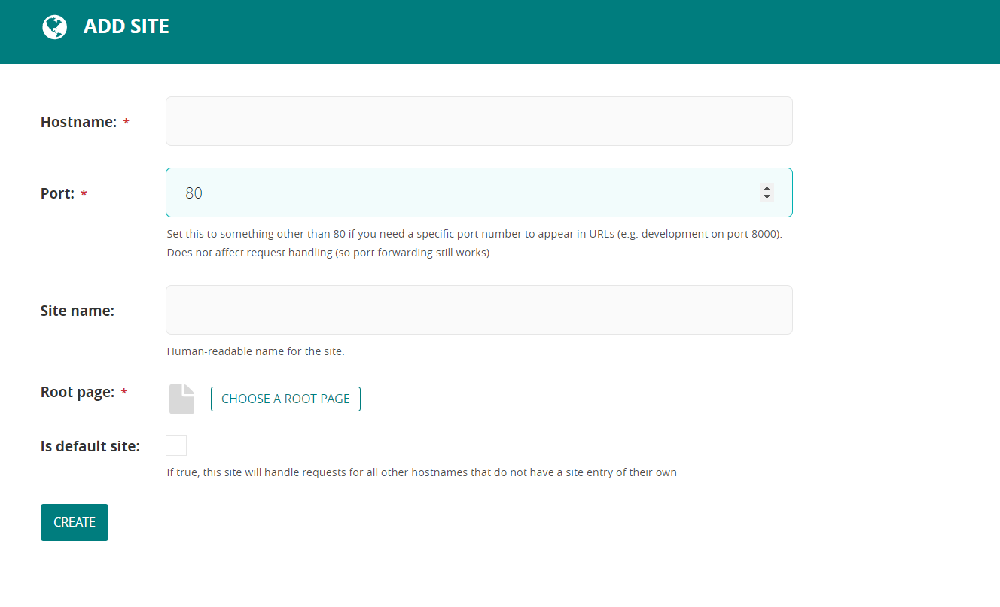
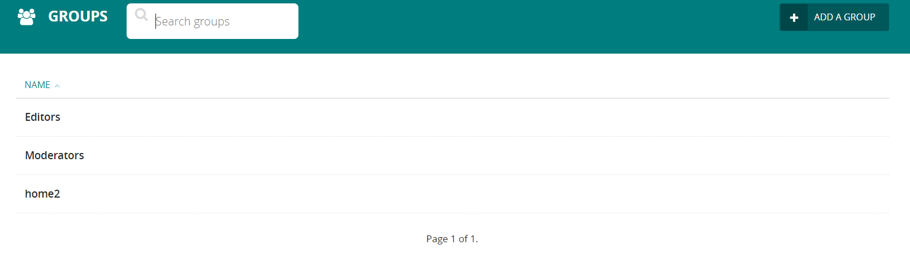
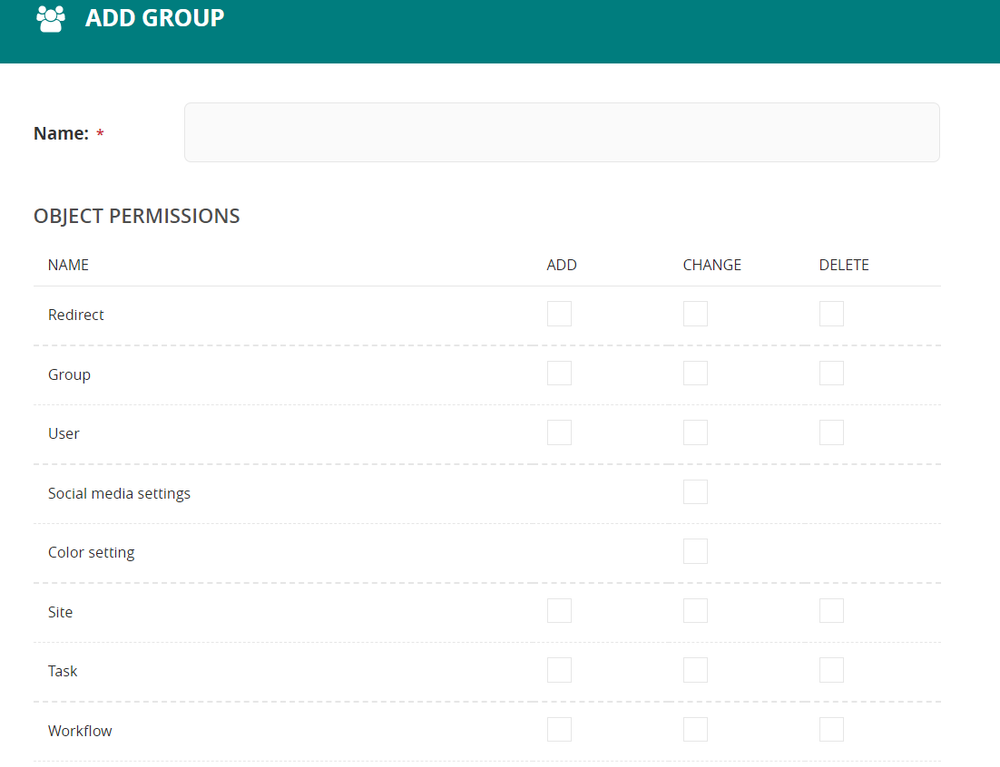
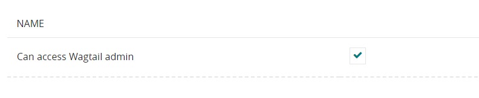

# Microsites/Subdomains Installation

 - add your fiedls into your home model (HomePage)

 - create home page for each micro website (in admin site)

 - go to the setting and add microsite from the settings --> site panel (at admin site)

   - go to setting in admin 

   - go to sites 



   - add new site 
    


   - choose a root page
 


## Site settings
- make a new app (for example: SocialMedia)
- add your app into INSTALLED_APP
```
INSTALLED_APPS = [
    ...
    'socialMedia',
    ...
 ]   
```
- add this into TEMPLATES in settings ` 'wagtail.contrib.settings.context_processors.settings',` in section `'context_processors'`
- in models.py for this app add:
```
from wagtail.contrib.settings.models import BaseSetting, register_setting
from wagtail.core.models import Page
from wagtail.admin.edit_handlers import FieldPanel

@register_setting
class SocialMediaSettings(BaseSetting):
    facebook = models.URLField(
        help_text='Your Facebook page URL')
    instagram = models.CharField(
        max_length=255, help_text='Your Instagram username, without the @')
    content_panels = Page.content_panels +[
        FieldPanel("facebook"),
        FieldPanel("instagram"),
       ]
```
- to access this settings in your template `settings.[app-name].[setting-model-name].[field-name]`, 
- for Ex: `{{ settings.socialMedia.SocialMediaSettings.facebook }}`


## to control access for materials we can create new group 

   - go to settings, choose groups (in admin site) 

   - add new group 
    


   - modify permissions 
    



------


   ### **Note**: 
   *dont forget to give the new group a permission to admin site to enable it in login process* 



   - create a new user and regester it to hes/her group from user section inside the setting 


--------


**for more information**

 [Multi-site Wagtail](https://wagtail.org/blog/multi-site-wagtail/) 


